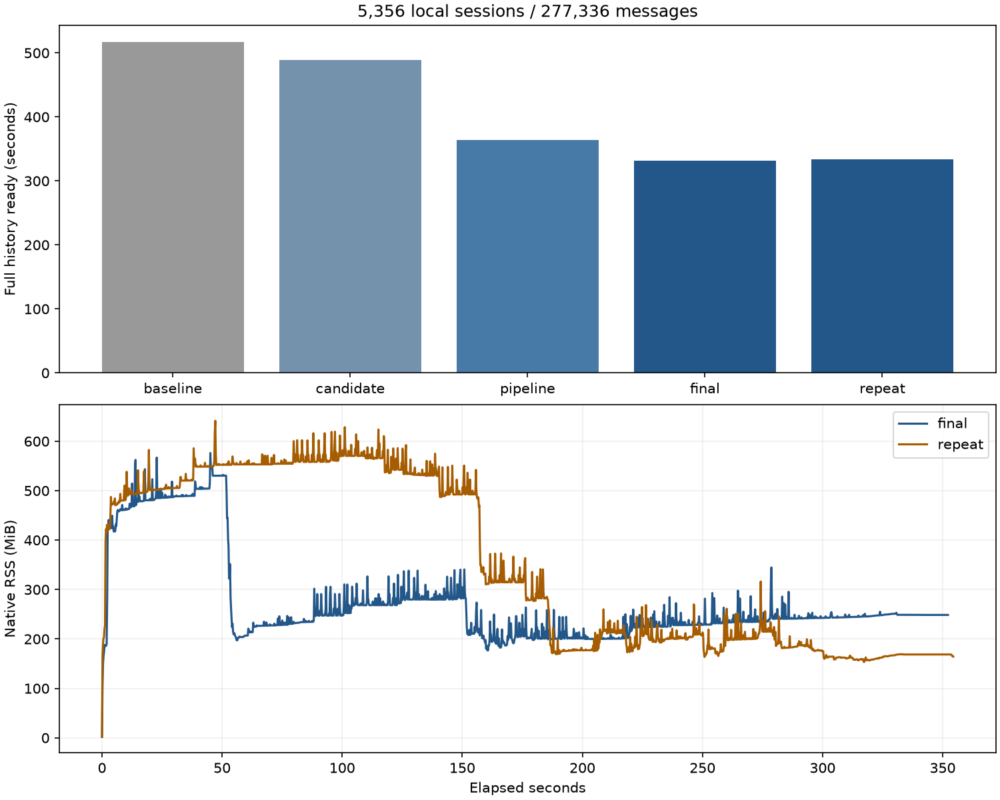

# 完整历史回填吞吐优化

本轮接续 [JSONL 与内存报告](rust-streaming-memory-2026-09-25.md)，保留 SQLite，目标是减少完整历史处理等待。代码提交 `a6ebd50d9243f0c16d60cbfd960727c3c96c432c`；本机 release SHA-256 为 `fc0a0c5550fa1a7eb5358a1e5ebf954ceaa711ce1f241750c7c8bd0f43984014`。

## 测量后采用的改动

1. **会话头快照增量解码。** 原本每批发布重新读取所有会话的所有字段并解码 JSON；现在按数据库排序读取身份，仅解码变化或新增的会话，复用其他会话头。持有读取事务，通过 `data_version` 识别其他连接的修改并回退完整读取。仍需构造完整快照，复杂度没有降为 O(批次大小)；减少的是 O(全部会话数) 的重复字段读取和 JSON 解码。
2. **有界预解析。** 当前批次发布期间，只在全局扫描信号量还有空位时预解析下一批。没有增加扫描并发上限，每个预解析批次持续占有许可直到发布完成。并发上限为 1 时仍顺序执行。发布失败、取消或提前退出时，等待并丢弃未发布的预解析结果，再重新进入扫描器；通知有待处理变化时停止进一步预解析，保留通知供后续处理。
3. **消息只写一次工具元数据。** 原本先插入包含正文的消息，再 UPDATE `tool_metadata_json`；现在在 INSERT 中写入工具元数据，避免重写包含大正文的消息行。工具筛选事实和费用汇总仍保留原行为。
4. **固定页缓存预算。** 写连接的 SQLite 页缓存建议上限从默认约 2 MiB 调整为 16 MiB，减少建库期间页面替换。没有修改事务同步级别，也没有关闭索引或外键。

新增 `CODESESH_PROFILE_SCAN=1` 诊断开关，向 stderr 输出每批解析、写入、快照、消息、文档索引、事实派生和事务提交的毫秒数。不输出正文或来源路径。流水线各阶段可以重叠，阶段耗时之和不能直接作为总墙钟时间。

## 数据与边界

使用本地会话隔离副本，5,356 个会话、277,336 条消息。原始来源与用户缓存没有测试写入。测试使用相同定价与来源内容，保留 16 MiB / 32 来源的批次约束；单个超大来源仍可超过该字节预算。

对照与候选测试部分时段重叠，因此这些是本机验收数据，不是独占机器下的性能排名。对照曾附加 5 秒系统采样，它的 RSS 不作为内存改善的可靠对比。最终候选不附加堆分析工具，使用 ps 与只读 proc_pid_rusage 采样。

## 结果

| 场景 | 全部历史处理完成 | 结束 RSS |
| --- | ---: | ---: |
| 优化前，仅添加计时 | 517.47 秒 | 164.7 MiB |
| 快照复用 + 页缓存 | 489.03 秒 | 176.5 MiB |
| 再加入有界预解析 | 363.41 秒 | 191.8 MiB |
| 最终候选：再合并消息元数据写入 | 331.32 秒 | 248.6 MiB |
| 最终候选重复完整扫描 | 333.74 秒 | 164.4 MiB |

最终两轮比本轮对照分别缩短 36.0% 和 35.5%。不将不同候选间的全部差异归因于某一改动，测试背景负载与文件系统缓存也会影响结果。

| 最终候选 | 峰值 RSS | 结束 physical footprint | 系统峰值 footprint |
| --- | ---: | ---: | ---: |
| final | 576.2 MiB | 83.6 MiB | 251.3 MiB |
| repeat | 641.4 MiB | 94.5 MiB | 253.4 MiB |

| 阶段（所有 Agent 累计） | 对照 | 最终候选 |
| --- | ---: | ---: |
| 解析及扫描编排 | 200.52 秒 | 203.02 秒 |
| 事务写入 | 315.93 秒 | 286.18 秒 |
| 快照解码与发布 | 21.84 秒 | 6.88 秒 |

缓存比对一致：全部 277,336 条消息的内容链摘要与工具元数据、5,356 个会话头投影、文档事实与正文长度、模型费用、费用汇总、工具筛选记录、文件活动。未声称对整个 SQLite 文件做字节一致比较；文档正文未另做全文字节哈希。

| 增量验收 | 初始验证完成 | 检查数 | 峰值 RSS | 结束 RSS |
| --- | ---: | ---: | ---: | ---: |
| incremental | 17.12 秒 | 74 | 287.9 MiB | 105.2 MiB |
| stress | 16.31 秒 | 33 | 406.2 MiB | 156.8 MiB |

| 增量发布场景 | 中位数 | 范围 |
| --- | ---: | ---: |
| 文件追加/改写/删除/恢复 | 278 ms | 217–828 ms |
| 保持连接打开的 WAL | 1852 ms | 1286–3067 ms |
| 最大 JSONL 追加/恢复 | 2648 ms | 2288–3008 ms |
| 连续追加/恢复 | 2063 ms | 286–2192 ms |

107 项均通过，30 次无变化通知为 0 upsert、0 remove。包含保持打开的 JSONL 追加、SQLite WAL 更新、删除与恢复，以及页面 API/SSE 请求。最终恢复为 5,356 个会话。

## 验证

本地 198 个 Rust 测试通过，3 个既有测试忽略；44 个原生进程/API/缓存契约检查通过；严格 Clippy 与格式检查通过。新增回归覆盖快照更新、删除、排序、其他连接改写，以及发布锁冲突后丢弃预解析批次。

这次没有实现 JSONL 字节尾部解析，也没有改变“完整历史处理结束”的页面判定。解析版本与缓存 schema 均未增加，不会仅因这次升级强制失效已有会话缓存。

SQLite 页缓存参数见 [官方 PRAGMA 文档](https://www.sqlite.org/pragma.html#pragma_cache_size)。
