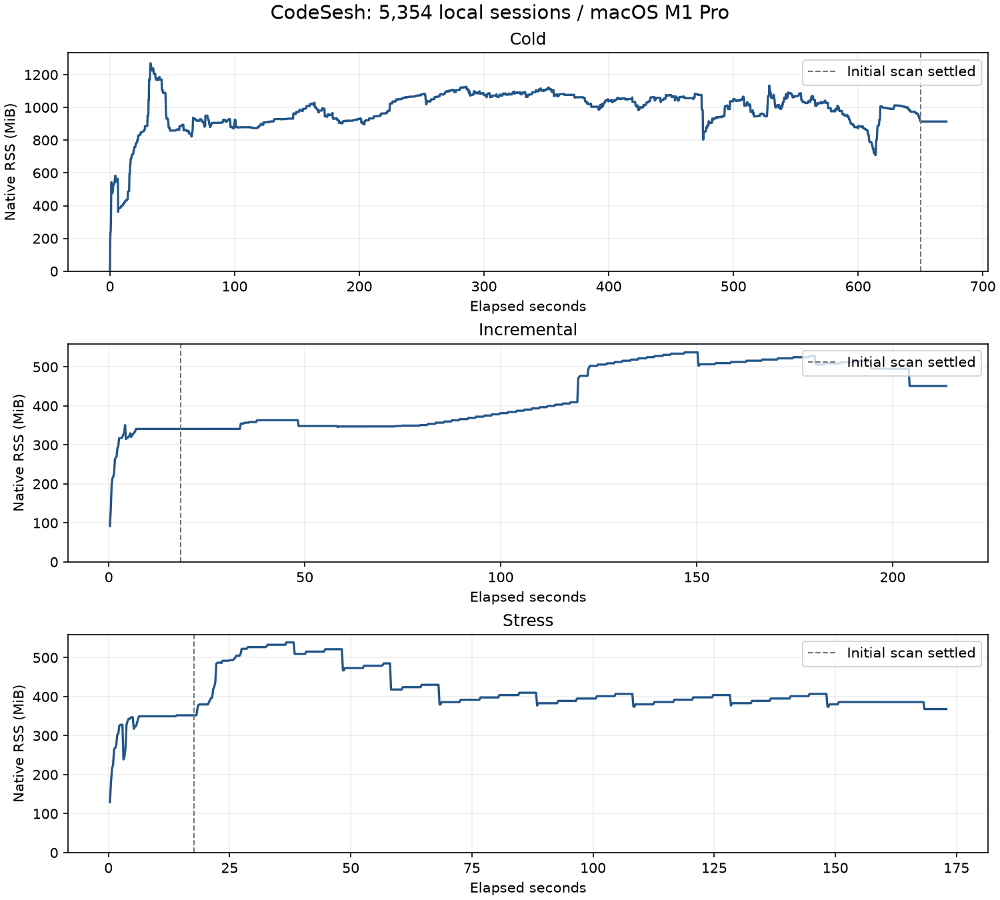

# 本地真实会话扫描：内存与增量验证

本报告记录 Rust 迁移后，针对 `pnpm run:app` 扫描内存持续增长的修复和本机验收。
原 P6 报告使用合成数据，不能用来证明本机完整历史上的内存和增量行为。

## 数据与隔离

- 机器：Apple M1 Pro，10 个物理核，32 GiB 内存，macOS arm64。
- 原始会话只读；文件使用 APFS 副本，SQLite 使用只读连接备份。
- 冷扫描和增量测试使用独立 HOME、缓存、用户状态及日志。
- 有源数据的 10 个 Agent 合计 5,354 个会话；各 Agent 的 `messageCount` 合计 712,966，落库规范化消息为 277,269 条。
- Codex 源文件约 19.4 GiB，最大单文件约 464 MiB；完整扫描生成约 10 GiB SQLite 缓存。
- Cursor、ZCode 只有旧缓存记录，对应源数据库已不在原路径；Minimax 没有本地源数据。
  这三个 Agent 不计入真实数据增量通过数量，其夹具兼容测试单独保留。

| Agent | 会话数 |
| --- | ---: |
| Codex | 4,012 |
| Claude Code | 630 |
| Cherry Studio | 348 |
| Pi | 219 |
| OpenCode | 60 |
| DeepChat | 51 |
| Kimi-Code | 16 |
| Kimi | 14 |
| Grok | 3 |
| DSH | 1 |

## 修复

| 问题 | 原行为 | 当前行为 |
| --- | --- | --- |
| 扫描常驻状态 | `AgentScanner.previous` 保留所有完整消息；恢复缓存也读取全部正文 | 常驻会话头、路径和必要附件摘要；正文随批次释放 |
| 数据库适配器 | OpenCode/ZCode 增量快照重复保留正文；Cursor 保留 composer 正文并一次收集原始数据库行 | 提交前后保留比较需要的元数据；Cursor 逐行读取、按受影响会话解析 |
| 大文件批次 | 只限制 32 个来源，未考虑大小 | 同时按约 16 MiB 源文件大小分批；单个大文件及父子依赖可以超过该值 |
| 文件增量与重启 | 重复通知和热启动仍解析正文 | 原子保存来源指纹，结合价格及项目身份判断复用；失败发布不推进状态 |
| Codex 标题与子会话 | 标题索引变动使全历史失效；增量还处理无关子会话 | 按实际标题变化失效，只聚合受影响父会话的子会话 |
| macOS 持续打开的文件 | SQLite WAL 提交后 90 秒仍未收到原生监听更新 | 保留原生监听，补充 2 秒一次的元数据检查，保留纳秒时间、文件大小和 inode |
| 监听范围 | 包括整个 Agent 数据根目录 | 仅会话目录、相关索引、附件和数据库；不遍历 `.codex/worktrees` |

内存目标是随会话头和当前解析批次增长，而不是随全部历史正文增长。DSH 只保留附件摘要。
macOS 补充检查不读取文件内容；其他平台继续使用原生监听。WAL、journal 被映射回所属数据库，
共享内存文件 `-shm` 不触发正文刷新。

## 测量方法

每约 200 ms 采样原生后端 RSS，检查扫描状态直到全部回填完成，再观察空闲阶段。
增量通过 `pnpm run:app` 启动，对完整副本执行三轮无变化通知及追加、修改、删除、恢复、
新增会话和 WAL 操作。以缓存发布后的实际会话行与消息内容校验结果，不只检查 HTTP 200。
数据库写连接在 WAL 检查期间一直保持打开。

增量报告分别记录首次观察到发布的耗时与额外等待稳定后的耗时；后者包含至少 400 ms 稳定观察及额外校验查询时间。
RSS 只统计原生后端，不包含 pnpm、浏览器和验证脚本。

价格代际发生变化会重新计算历史成本。本轮曾观察到这种情况，将其单列，不能当作普通热启动。
随后在隔离定价缓存中固定相同价格数据再测重启。
验证脚本最初给 DSH 的独立 zstd 帧添加了空行，产生非法记录；修正帧格式、恢复来源副本后，
重新执行完整 74 项验收。该次脚本错误和价格重算过程均未混入正式增量指标。

## 结果

验证代码提交：`091d27d616e7c01ecb4dca68e9ae3db633912325`。
本机 release 二进制 SHA-256：
`9ce24eaca7ef75ed5a2111c9caa629169ec6a7485894895a5545da4b384b3acf`。

| 场景 | 结果 | RSS |
| --- | --- | --- |
| 空缓存完整扫描 | 5,354 会话，约 650 秒完成，无失败 Agent | 峰值 1,269 MiB；完成后观察约 20 秒，稳定在 914 MiB |
| 热启动及普通增量 | 热启动 18.39 秒，74 项检查通过，结束仍为 5,354 会话 | 整轮峰值 537 MiB；空闲后 451 MiB |
| 大文件及持续追加 | 热启动 17.61 秒，33 项检查通过，结束仍为 5,354 会话 | 整轮峰值 539 MiB；空闲后 368 MiB |

普通增量按发布后的内容及索引行核验：

| 检查 | 数量 | 发布耗时中位数 | 范围 |
| --- | ---: | ---: | ---: |
| 无变化通知 | 30 | 208 ms | 172–425 ms |
| 文件追加、标题修改、删除、恢复、新增会话 | 32 | 283 ms | 229–693 ms |
| SQLite WAL，写连接始终打开 | 12 | 2,237 ms | 1,769–2,332 ms |

全部无变化通知为 0 upsert / 0 remove；其余每次只发布预期的 1 个会话变更。
WAL 延迟包含 2 秒元数据检查间隔。普通增量最后约 19 秒的 CPU 时间占单核约 4.38%，
包含 macOS 元数据巡检和状态查询；不是整个机器的 CPU 百分比。

压力轮次保持 SSE 消费，并读取会话列表、项目和 Dashboard API：

- 最大 Codex 来源为 486,192,413 字节（约 464 MiB）；保持文件打开追加一条消息，3.967 秒发布，恢复原内容需 3.405 秒。
- 小会话保持同一文件句柄连续追加 30 次，每轮等待发布后再追加；中位数 2254 ms，范围 2084–2322 ms。最后恢复原内容，共 33 项检查。
- 每次只更新目标会话，未观察到漏更或全历史重写。SSE 消费收到 3,564 个事件帧；最终会话数不变。
- 第 1 次小会话更新后 RSS 为 533 MiB，第 30 次后为 380 MiB，最后空闲后为 368 MiB。RSS 有波动及回落，本轮未观察到随更新次数持续线性增长。
- 压力轮次最后约 19 秒 CPU 时间占单核约 4.85%。macOS 元数据巡检有固定开销；这不是零成本监听。

[脱敏样本与逐项结果](rust-local-memory-2026-09-25.json)保留约 200 ms 的 RSS 样本、耗时、CPU 时间和变更数量，
不包含原始会话内容、身份或本地路径。虚线表示启动扫描完成。冷扫描、普通增量和持续追加是三个独立进程，
不能把各自峰值和空闲值拼成同一条曲线。RSS 是采样值，不代表瞬时硬上限。

代码验证：194 项 Rust 测试、44 项原生进程/API/缓存检查通过。
[修复提交 CI](https://github.com/xingkaixin/codesesh/actions/runs/36132360691) 共 19 项通过，
覆盖四个原生目标及八组 npm 安装。

## 已知边界

- 单个大文件仍需完整解析；当前增量粒度是变化会话，不是追加字节数。
- 16 MiB 是分批依据，不是进程 RSS 上限，也不会截断超大消息或会话。
- 冷扫描遇到大文件时仍有明显内存峰值；是否持续增长、空闲后的 RSS 和连续更新后的趋势分开报告。
- 本报告验证 Web 模式及其运行时；不据此推断 `--json` 冷全量扫描或浏览器进程的内存。
- 本机结果不代表其他平台的 RSS。跨平台 API、缓存兼容、安装和回归状态以当前 CI 为准。
