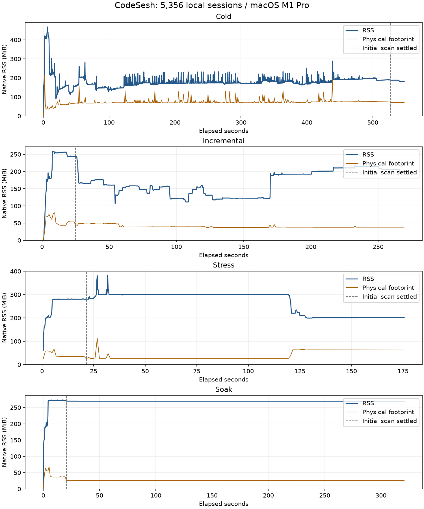

# JSONL 解析、索引与常驻内存优化

本报告接续 `rust-local-memory-2026-09-25.md`。上一轮消除了全部历史正文常驻，但 300 MiB 以上的空闲 RSS 仍偏高。本轮进一步减少原始 JSON 对象、重复文本、索引工作和常驻元数据，并重新验证本机完整会话量。

## 确认的问题与改动

- Codex、Claude Code 原本已经逐行读取 JSONL；问题不只是读取文件的 API。每行仍可能构造不需要的 JSON 子树，正文清理、序列化和缓存发布也产生重复分配。
- JSONL 读取复用 64 KiB 缓冲区和行字符串；超过 1 MiB 的行缓冲使用后释放，避免长期保留异常大行的容量。
- Codex 先读取借用的 `RawValue` 信封。无关事件仅保留类型、时间等字段；需要的消息与 Token 事件仍完整解析，异常结构回退到原解析方式。
- Pi 不再同时保留完整原始 JSON 树和规范化消息。第一遍记录分支 ID、父节点与字节偏移，第二遍只读取活跃分支。顺序位置不额外 seek，并检查二次读取的节点身份。
- 清理正文时不再为未匹配规则复制整段文本；多个适配器共享相同的已编译正则，保留两种既有标签清理顺序及各自的空白处理行为。
- 写入消息逐项序列化；工具元数据先排除 input/output 再序列化。插入复用 SQL statement。
- `session_documents` 原本插入后再更新版本，触发 FTS 删除及重建；现在一次插入带上版本，避免首次建库的重复分词。
- 恢复扫描器仅读取当前 Agent 的会话头；父子关系索引只保存父引用和来源路径，不再复制整份会话头。完整回填后释放比较元数据，下一次变化再从 SQLite 紧凑恢复，减少长期对象造成的堆碎片。
- 并发许可覆盖解析和 SQLite 发布，限制等待写入的已解析批次数量。
- macOS 在批次数据释放后，最多每秒一次、以及扫描完成时请求系统分配器归还空闲页。
- macOS 默认启用 libmalloc 的 `MallocSpaceEfficient=1`，避免已释放的大块内存长期留在分配器缓存。该策略由系统在进程初始化时读取，原生入口在建立运行时前通过一次 `exec` 应用，保留 PID、参数和 I/O。`pn run:app`、npm launcher 和直接运行原生二进制行为一致；用户已经设置该变量时保持原值，`MallocSpaceEfficient=0` 可显式关闭。其他平台没有加入分配器依赖。
- 标签规则的单词边界与冻结 JavaScript 参考保持一致，采用 ASCII `\b`。增加标签后紧接中文、下划线和字母的回归检查。解析版本进入来源指纹校验；此前缓存会重新验证一次，后续重启继续复用。

这里的“逐行”不意味着单会话全流程固定内存：规范化后的单个会话消息仍会保留到事务写入完成。大消息、超大单会话、工具输出和 SQLite FTS 都可能产生较高峰值。没有声称已经实现按 JSONL 字节偏移继续解析的尾部增量；变化文件仍按会话重新解析，未变化来源通过指纹复用。

## 页面长期显示扫描中

检查用户运行的 4521 端口后端时，Codex 完整历史进度确实从 1,805 推进到 3,782，最终完成 4,012 个来源，状态转为 idle，页面提示消失。该次运行约 19 分钟完成历史处理。它使用的是优化前进程及已有缓存，不能与空缓存首次建库直接对比；旧索引替换、来源重新验证和价格代际都可能增加工作量。

没有停止用户的进程。磁盘上的新 release 二进制需要重启 `pn run:app` 后才会被该实例使用。

## 数据、口径与限制

使用本机来源的隔离副本，共 5,356 个会话：Codex 4,012、Claude Code 630、Cherry Studio 348、Pi 220、OpenCode 60、DeepChat 52、Kimi-Code 16、Kimi 14、Grok 3、DSH 1。Cursor、ZCode、Minimax 没有本地来源，不计入真实数据增量通过数量。

Codex 来源约 19.4 GiB，最大单个 JSONL 为 486,192,413 字节。原始来源和用户缓存未执行测试写入。RSS 每约 200 ms 从原生后端进程采样，排除 pnpm、浏览器和验证脚本。空闲要求扫描与回填均结束，连续观察约 20 秒。

测试采用相同定价数据并更新隔离缓存的抓取时间，避免测试期间远端定价变化触发额外重算。多项隔离验证可能并行，耗时是本机验收数据，不是无背景负载的严格吞吐排名。

## RSS、存活分配与 physical footprint

这三个指标分别记录，不用一个数替代另一个。诊断中，一轮热启动空闲的 RSS 约 294 MiB，physical footprint 约 93 MiB，存活堆分配约 57 MiB；而另一轮冷扫描结束后，footprint 仍约 587 MiB，存活堆约 111 MiB，说明冷扫描后的分配器空闲块和碎片确实需要进一步处理。

`vmmap` 在该冷扫描对照中报告约 431 MiB 的空闲大块区域。Apple libmalloc 的空间优先策略会禁用大块缓存，并更积极地回收页面，因此本轮采用系统策略，没有替换整个分配器。

最终验收通过只读的 `proc_pid_rusage` 同时记录 footprint 和系统记录的峰值 footprint。`heap` / `vmmap` 附加诊断会影响页面驻留，因此带这些诊断工具的试验不混入正式 RSS 曲线。另一次旧候选的 5 分钟空闲试验在结束前附加了堆诊断，也不作为最终稳定性数据。

## 结果

代码提交：`65f42c76654863393db562793fdd9658f5e847c4`。本机 release SHA-256：
`65c9f801e267685c7706a33286d56f55bd8e6b7c93ff9a3455f35ab763a72108`。

| 场景 | 初始扫描完成 | 峰值 RSS | 结束空闲 RSS | 验证 |
| --- | ---: | ---: | ---: | --- |
| 空缓存完整扫描 | 526.96 秒 | 468.0 MiB | 181.6 MiB | 5,356 会话及索引 |
| 普通增量 | 24.84 秒 | 259.0 MiB | 196.4 MiB | 74 项通过 |
| 大文件与连续追加 | 21.61 秒 | 382.9 MiB | 201.1 MiB | 33 项通过，含页面 API 与 SSE |

同一后端、系统默认分配器对照：完整扫描 504.46 秒，峰值 RSS 1082.3 MiB，结束 RSS 598.2 MiB。

冷扫描与对照使用 `558b1536` 后端；优化轮显式设置 `MallocSpaceEfficient=1`。最终 `65f42c76` 仅在入口自动应用相同策略；增量、压力、解析对比及五分钟空闲使用最终二进制。JSON 保留各轮二进制哈希，不将不同文件标为同一制品。

普通增量及压力测试通过 `pnpm run:app` 启动。所有变更只作用于隔离来源副本，最终恢复为 5,356 个会话。发布延迟由实际缓存消息或索引更新确认；不包含额外等待稳定的时间。

| 场景 | 数量 | 发布耗时中位数 | 范围 |
| --- | ---: | ---: | ---: |
| 无变化通知 | 30 | 276 ms | 166–1438 ms |
| 文件追加/修改/删除/新增/恢复 | 32 | 275 ms | 220–1390 ms |
| 保持写连接打开的 WAL 更新 | 12 | 1920 ms | 1725–2215 ms |
| 最大 JSONL 追加及恢复 | 2 | 3248 ms | 2592–3904 ms |
| 连续 30 次追加及恢复 | 31 | 2012 ms | 331–2131 ms |

30 次无变化通知全部为 0 upsert、0 remove；该行耗时是确认通知处理完成的时间，没有实际发布。
incremental 最后约 19 秒 RSS 范围为 196.4–209.6 MiB，CPU 约为单核的 4.47%。
stress 最后约 19 秒 RSS 范围为 201.1–201.3 MiB，CPU 约为单核的 5.12%。

最终二进制热启动 20.55 秒完成验证，随后连续空闲超过 300 秒。稳定段 RSS 269.5–269.5 MiB，结束 physical footprint 25.9 MiB。

| 场景 | 结束 physical footprint | 系统峰值 footprint |
| --- | ---: | ---: |
| cold | 71.3 MiB | 269.5 MiB |
| incremental | 38.2 MiB | 115.0 MiB |
| stress | 62.4 MiB | 114.1 MiB |
| soak | 25.9 MiB | 103.4 MiB |

最大文件解析对比采用 `--json --no-cache --agent codex --days 0`，不包含 SQLite/FTS 写入。三轮新旧输出 SHA-256 完全一致。

| 构建 | 三轮耗时 | 最大 RSS 范围 |
| --- | --- | --- |
| before | 2.88s / 2.67s / 2.68s | 180.8–182.4 MiB |
| final | 1.95s / 1.93s / 2.15s | 164.2–164.5 MiB |

本地 195 个 Rust 测试、44 个进程/API/缓存兼容检查及严格 Clippy 均通过。
历史报告的 5,354 会话结果保留在原文件中；上述 5,356 会话结果不覆盖历史证据。

## 未采用的方案

尝试 mimalloc 后，最大单会话解析与实际扫描 RSS 都更高，因此已撤回，没有新增分配器依赖。读取实时来源缓存的两轮对比始终有来源变更，没有形成持续空闲窗口，不能当作空闲 RSS 证据。中途停止、继续改动后的构建轮次不计入最终通过结果。

## 技术依据

- [Rust BufRead](https://doc.rust-lang.org/std/io/trait.BufRead.html)：缓冲和复用读取。
- [Serde JSON RawValue](https://docs.rs/serde_json/latest/serde_json/value/struct.RawValue.html)：借用 JSON 片段，避免不需要的完整对象构建。
- [Apple 内存指标说明](https://developer.apple.com/videos/play/wwdc2022/10106/)：footprint 包括脏页、压缩与换出部分；RSS 还可能包括可回收的干净页。
- [Apple libmalloc 实现](https://github.com/apple-oss-distributions/libmalloc/blob/main/src/malloc.c)：`MallocSpaceEfficient` 的空间与时间取舍、大块缓存控制。
- [Apple malloc API](https://github.com/apple-oss-distributions/libmalloc/blob/main/include/malloc/malloc.h)：`malloc_zone_pressure_relief(NULL, 0)` 请求所有分配区归还可释放页。
