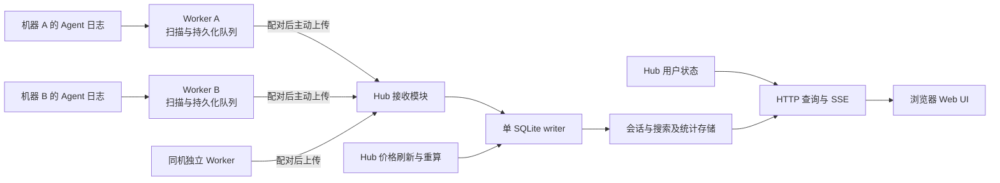

# CodeSesh Hub / Worker 架构与功能设计

日期：2026-09-28  
状态：第一版已实现并发布；本文记录设计决策与数据语义  
范围：单用户、单 Hub、多来源节点、本地及跨机器会话集中浏览  
说明：命令、接口路径、字段和表名以代码为准；修改实现不得改变本文确认的数据语义。

## 1. 设计目的

CodeSesh 当前在本机发现、解析和保存 AI 编码 Agent 会话，并通过 Web UI 提供浏览、搜索和统计。新的架构允许用户在一台机器运行 Hub，在多台机器运行 Worker，将不同机器上的会话集中保存和展示。

核心体验：用户在开发机产生会话，在另一台机器的浏览器中打开 Hub，即可查看已同步的会话。开发机离线或休眠不影响 Hub 上已有历史的浏览。Hub 临时停机时，Worker 可以继续采集并持久化待上传内容，恢复连接后补传。

不将本次工作扩展成分布式任务调度平台。第一版不引入 Kafka、多主复制、通用远程命令执行或团队权限系统。

## 2. 已确认的产品决策

| 项目 | 第一版决策 |
| --- | --- |
| 使用范围 | 单用户、多机器；一个 Worker 同时只连接一个 Hub |
| Hub 职责 | 接收、持久保存、搜索、统计、费用估算、Web UI、用户状态和节点管理 |
| Worker 职责 | 本机发现、解析、增量采集、持久化待上传数据、可靠上传 |
| 默认单机体验 | 保留现有入口和本机使用方式 |
| 纯 Hub | 支持不启用本机采集，也可以没有任何 Worker |
| Hub 所在机器的采集 | 由独立 Worker 执行；验证同机身份后复用本地来源，仍需配对和上传 |
| Hub 不可达 | 已配对且此前已兼容的 Worker 继续采集，持久化积压并重试连接 |
| 明确版本不兼容 | 停止采集和数据上传，保留队列，低频检查兼容状态 |
| Worker 积压上限 | 第一版不设置容量额度，不实现达到额度后暂停的策略 |
| 来源删除 | 不据此删除 Hub 已接收的历史 |
| 界面删除会话 | 第一版不新增该功能 |
| 附件 | 同步已解析的路径和内容，不因引用路径而读取、上传实际文件 |
| 远程操作 | 不在 Worker 上远程执行命令或继续会话 |
| 跨机器相同会话 | 按来源隔离，第一版不自动去重 |
| 跨机器项目 | 不按目录同名自动合并，沿用现有分组能力 |
| 用户状态 | 收藏、自定义标题、项目分组等由 Hub 管理 |
| 价格 | 保持单机版估算语义；由 Hub 查价、重算，增加长期运行时的周期刷新 |
| 首次扫描顺序 | 沿用当前单机窗口优先及历史回填逻辑 |
| 全量重采集 | 支持 Worker 因解析修订主动触发，也支持 Hub 手动或恢复时要求执行 |
| 旧单机转 Hub | 保留现有历史和用户状态，迁移到本地来源身份 |
| 旧单机转 Worker | 可选择导入已有会话历史；不自动合并旧用户状态到远端 Hub |
| 旧数据清理 | 与是否导入分开决定；不能默认删除未导入数据 |
| 配对 | 用户明确授权，一次性令牌换取节点独立凭证，可撤销 |

### 2.1 无需进一步确认的实现默认值

以下属于实现方案，不要求用户在开发前逐项决定：采用 Worker 主动发起 HTTP(S) 请求；第一版每个远程 Worker 只有一个数据批次在途；Hub 延续 SQLite 单 writer；使用持久化 outbox；心跳和上传共享身份校验；控制请求通过 Worker 主动通信下发。

心跳时间、请求体上限、批次大小、超时和退避参数应有集中默认值，按实际负载调整。本文不虚构已验证的性能数字。

## 3. 术语与身份

| 术语 | 定义 |
| --- | --- |
| Hub | 集中保存和查询会话的运行角色 |
| 来源节点（Source Node） | 会话来源的持久身份，不等同于当前进程或机器名称 |
| Worker | 为一个来源节点执行采集和上传的运行角色 |
| 本地来源节点 | Hub 本机的来源身份，可以存在历史而不启用采集 |
| Agent | Codex、Claude Code 等被采集工具，不是 Worker |
| 来源会话 | 某节点上某 Agent 的一个会话 |
| 来源标题 | Agent 原始数据提供的标题，由 Worker 同步 |
| 自定义标题 | 用户在 Hub 上维护的映射，不被来源标题更新覆盖 |
| 采集 checkpoint | Worker 安全持久化采集结果后可继续扫描的位置 |
| 上传确认水位 | Hub 已经持久应用的连续批次序号 |
| outbox | Worker 本地尚未获得 Hub 确认的持久化上传队列 |
| 采集修订号 | 某 Agent 解析语义的修订，不等同于产品版本 |
| Hub 数据代号（data epoch） | 标识当前 Hub 数据完整性及确认进度所属的一代数据 |
| 上传流（stream） | 某节点在某次同步上下文中的有序批次序列 |
| 重采集任务 | 有持久身份、作用范围、进度和完成状态的一次重新读取请求 |

### 3.1 会话身份

逻辑唯一键为：

```text
(source_node_id, agent_name, source_session_id)
```

机器名、IP、Hub URL、本机路径、标题和产品版本都不作为节点身份。节点改名、网络地址变化和程序升级不产生新来源。丢失本地身份后重新配对，不自动冒认旧节点；后续可设计受控的节点接管，但第一版不自动根据机器名合并。

父子会话引用、收藏、自定义标题、搜索命中、路由参数、统计归属及 SSE 消息都必须能区分节点。不能只修改 `sessions` 主键而遗漏其他引用。

来源节点存在、启用采集、在线、同步完成是四件不同的事。一个节点可以没有运行中的 Worker，但仍拥有可浏览的历史。

## 4. 当前代码事实及改造依据

本节来自本次设计期间对源码的核对。仓库后续变动时需要重新核对；不将当前结构当作目标协议。

| 当前事实 | 代码位置 | 对设计的影响 |
| --- | --- | --- |
| `SessionReference` 只有 Agent 和会话 ID | `crates/codesesh-core/src/contract.rs` | 跨节点身份必须扩展，并更新全部消费者 |
| 会话及大量关联表按 Agent、会话 ID 关联 | `crates/codesesh-core/src/storage/schema.sql` | 需要完整迁移关联键、索引、FTS 与派生事实 |
| 收藏和自定义标题是独立状态库中的映射 | `crates/codesesh-core/src/state/database.rs` | 要和会话身份协调迁移，不能留成旧键 |
| 扫描批次交给单 SQLite writer | `crates/codesesh-core/src/runtime.rs`、`runtime/writer.rs` | 适合将本地采集和远程接收汇入同一存储入口 |
| `ScanBatch` 含进程内回调、定价快照等 | `crates/codesesh-core/src/runtime.rs` | 不能直接序列化作为网络协议 |
| 扫描器持有 cache 路径、旧记录、fingerprint、checkpoint 等 | `crates/codesesh-core/src/discovery/incremental.rs` | 不能简单移除完整数据库就假设增量采集仍可运行 |
| checkpoint 已包含解析器版本判断 | `crates/codesesh-core/src/discovery/incremental.rs` | 优先沿用现有修订机制，不重复设计另一套相同概念 |
| 定价刷新任务在服务启动后执行一次检查 | `crates/codesesh-cli/src/pricing_refresh.rs` | 需补周期执行，当前并非自动定时刷新 |
| 价格缓存 TTL 为 24 小时 | `crates/codesesh-core/src/pricing/manager.rs` | TTL 不等于后台定时器 |
| 重算按模型和用量，未按历史生效时间选价 | `crates/codesesh-core/src/storage/reprice.rs` | 保持当前费用口径，不顺带引入历史价格账本 |

现有删除检测、来源解析、项目解析和用量估算在各适配器中存在差异。实现前须针对受影响路径核对，不假设所有 Agent 都有稳定消息 ID 或相同增量格式。

## 5. 运行架构



### 5.1 Hub 模块

- 节点管理：配对、凭证、版本检查、状态、撤销。
- 数据接收：校验 envelope、顺序、批次身份和会话操作。
- 持久化：会话、消息、统计事实、搜索索引、接收水位。
- 控制请求：保存某节点或全部节点的重采集任务。
- 查询与展示：沿用 HTTP、SSE、Web UI，加入来源筛选和节点管理。
- 用户状态：收藏、标题映射、分组等。
- 定价：价格获取、缓存、代际发布及估算更新。

不要求以上职责都拆成新 crate。优先在当前模块中形成清楚的接口，只有复用和依赖关系确有需要时才新增 crate。

### 5.2 Worker 模块

- 来源发现和 Agent 解析。
- 本地增量状态与解析修订管理。
- 采集结果到 outbox 的事务持久化。
- 顺序发送、确认、清理、重试。
- 配对身份和连接状态管理。
- 重采集任务执行及进度报告。

不运行完整浏览器查询服务，不构建本地全文搜索索引，不自行查价。保留必要的采集基线和临时解析状态，不承诺完全无状态。

### 5.3 本机采集

Hub 始终只负责接收、存储、定价和展示；不运行采集器。同机采集使用单独 Worker 进程，使用与远程 Worker 相同的 HTTP、心跳、队列和确认机制。

同一数据目录的 Hub 创建私有本机来源密钥。Worker 配对时使用 HMAC 绑定 Hub 身份、配对令牌和上传流，校验成功后沿用旧 `local` 来源。回环地址本身不能证明同机。旧历史不重复导入；Worker 只读旧库来建立自己的增量基线和 checkpoint。收藏、自定义标题、项目分组及旧会话 URL 保持不变。

### 5.4 命令行形态建议

```bash
codesesh
codesesh hub
codesesh worker --hub http://127.0.0.1:4521 --pair-token-stdin
codesesh worker --hub https://hub.example
```

- `codesesh`：保留当前单机入口、默认本机采集和浏览器体验。
- `hub`：纯 Hub，不隐式启用本机采集。
- Hub 不提供内置采集选项；本机采集也是独立 Worker。
- `worker`：不自动打开浏览器，使用已保存的配对配置持续运行。
- Hub 保留禁止自动打开浏览器的能力，适用于无桌面的机器。
- `--json` 等既有一次性扫描命令保持独立行为，不隐式开始远程同步。
- 操作系统自启动、安装系统服务和自动更新二进制不是本次第一版必需能力。
- 同一来源身份及同一 Worker 状态目录只能由一个采集进程占用，使用进程锁防止并发写入；不能同时启动默认模式和独立 Worker 抢占同一来源。

## 6. 数据所有权和归档语义

### 6.1 Worker 拥有来源事实

Worker 同步模型、提供商、消息、工具结果、Token 用量、来源费用、时间、路径、来源标题及 Agent 原始元数据。Hub 不把这些字段解释为用户主动编辑的数据。

### 6.2 Hub 拥有集中派生数据和用户状态

Hub 拥有估算费用、搜索索引、统计结果、用户收藏、自定义标题和项目分组。重采集不能覆盖用户自定义映射。展示标题优先使用自定义标题，否则使用最新来源标题。

### 6.3 来源消失不代表删除档案

来源文件删除、Agent 清理日志、节点离线、节点凭证撤销、一次扫描没有找到某会话，都不直接删除 Hub 历史。

Hub 可以记录“来源已不可见”等状态，但不把它变成内容删除。没有成功完成扫描时，不能把未发现解释为已消失。

同一会话的已确认内容修正和“整个来源文件消失”不同。有效的全量内容替换可以修正错误解析；替换的完整性必须可证明，不能用读取失败或半份文件覆盖完整历史。

归档保留是这次讨论确定的目标语义。现有单机适配器存在 `removed` 路径，实施时必须审计并显式调整共享接收策略，不能假定原代码已经满足归档保留。默认命令继续保留单机交互，但共享存储采用本设计的归档语义；应在发布说明中列出这一行为变化。

### 6.4 项目身份

先以来源节点隔离本地路径和项目身份，沿用既有项目解析规则。相同目录名或相同路径字符串不能跨机器自动合并。已有用户分组作为 Hub 映射保留；不因此新增自动仓库识别或远程路径映射系统。

## 7. 变化模型：元数据与会话内容

会话没有“上传完整后永不变化”的状态。它可以新增消息、更新工具结果、补充用量、修改标题，或者因解析修订重新解释历史。

### 7.1 建议操作类型

| 类型 | 用途 | 关键约束 |
| --- | --- | --- |
| `session.metadata` | 创建或更新基础信息 | 部分字段更新；省略表示不变，允许为空的字段以 null 表示清空 |
| `session.messages` | 新增或更新一组消息及用量事实 | 消息身份和顺序必须明确；已有消息更新必须替换旧统计贡献 |
| `session.snapshot` | 首次导入、无可靠增量身份或强制重解析 | 表示该次完整解析的内容视图，成功提交前不能暴露半份内容 |
| `source.status` | 来源可见性或解析状态 | 不隐含删除 Hub 会话 |

这些是同一数据接口中的操作，不拆成互不关联的上传及确认系统。一次采集同时发现标题和消息变化，可以在同一批次提交。

### 7.2 消息身份与回退

有稳定消息 ID 的 Agent，优先使用来源提供的身份并保留显示顺序。不能仅凭时间戳去重。只有数组下标的来源，如果存在插入、重排、截断，就不能假设下标永久稳定。

没有可靠增量身份时，允许使用完整会话快照替换。元数据变化仍可以单独传输，不必为标题重传所有内容。不要为了所有适配器都发送消息差分，而强行建立容易出错的内容匹配算法。

Worker 不保留完整历史内容后，某些来源更新可能需要重新读取一个会话并发送快照，这是允许的工程取舍。优先保证正确性，再依据实际上传成本优化差分。

当前差分按消息前缀实现，不依赖适配器的消息身份。Worker 为上次已发送的版本保存逐条消息的摘要链，不保存内容。新快照与上次版本有相同前缀时，只发送其后的消息，完成操作声明保留的前缀条数和上次版本的消息数与摘要。Hub 核对自己记录的上次版本后，用已存的前缀拼出完整快照再提交。核对失败时 Hub 确认该操作但不提交，并为该 Agent 排一次重扫，由重扫发送完整快照。

### 7.3 完整快照与大消息

单次请求仍需有字节上限，不能因为没有 outbox 容量上限就允许无界 HTTP 请求。

大快照可分块传输至 Hub 暂存区，携带快照标识、分块位置和内容摘要，最后发送完成操作。完成前保留上一个已发布版本；验证完整后事务切换。后续对同一会话的更新必须排在快照完成之后。

超大单条消息也需可分块承载，不能形成永远无法发送的队首数据。第一版不静默截断会话。分块是数据接收的一部分，不扩展为附件上传系统。

Hub 暂存区属于可靠接收数据：如果某分块已经返回持久确认，不能因普通超时就静默删除。若需要放弃或重置，必须显式通知 Worker 重新发送。未确认或已终止任务的临时数据才可安全回收。

### 7.4 来源事实和估算输入

来源费用应标记其来源性质，不能把旧数据库中的 CodeSesh 估算值伪装成 Agent 原始费用。保留必要的估算输入，包括现有适配器计算需要的 Token、模型、搜索次数或其他已支持维度。

现有 `cost_inputs` 有跳过序列化的内部字段，不能仅发送浏览器 wire 类型就认为信息完整。同步契约需要独立表达这些事实，并通过现有适配器样例验证等价性。

## 8. Worker 持久化与生命周期

### 8.1 本地存储内容

建议使用一个 Worker SQLite 状态库，至少覆盖：

- 稳定来源身份、配对 Hub 身份、非秘密连接信息。
- 上传流身份、下一序号、最后确认水位。
- Agent checkpoint、采集修订号、必要 fingerprint 和消息基线。
- outbox 操作、序号、格式版本和内容摘要。
- 重采集任务执行状态。
- 旧单机数据导入进度。

凭证以私有权限保存，日志不打印。具体使用独立凭证文件还是私有状态存储按已有平台能力决定。

Worker 正常上传并确认后删除 outbox 内容，不继续维护完整历史镜像。但 checkpoint、来源标识及必要索引仍可能随会话数量增长。不能承诺“本地存储只与 Hub 停机时间有关”或“同步后磁盘占用归零”。应区分持久采集元数据、待上传内容、迁移保留文件及 SQLite 可复用空闲页。

### 8.2 采集事务

```text
读取并解析来源
    → 开启 Worker 事务
    → 保存待上传操作
    → 保存与操作对应的 checkpoint / 基线
    → 提交事务
    → 上传器可见
```

checkpoint 不能先于 outbox 单独提交。事务失败时不推进采集位置。扫描器内存状态也必须能回退或从已提交状态重新加载，不能重启前后行为不同。

### 8.3 确认与清理

```text
收到当前 Hub 数据代号、当前上传流的有效确认
    → Worker 事务中记录确认水位
    → 删除该水位以前已确认的队列数据
    → 提交
```

Worker 在确认后、清理前崩溃会重传，Hub 幂等处理即可。不能通过发出请求、收到 HTTP 连接建立事件或看到心跳在线来判断交付成功。

### 8.4 第一版不设置积压容量上限

不做额度配置、到额度暂停、自动丢弃旧数据或按 TTL 删除待上传数据。

仍必须处理真实写盘失败：磁盘满、权限变化、数据库损坏时停止推进采集进度，报告明确错误，不能伪装采集成功。这是基本错误处理，不是新增容量策略。

数据库删除记录后文件不一定立即缩小。优先复用空闲页及安全 checkpoint；是否执行增量整理按实际测量决定，不在上传热路径反复完整 VACUUM。

## 9. 上传协议与确认规则

### 9.1 传输方式

Worker 主动向 Hub 建立 HTTP(S) 请求。可信局域网允许 HTTP，公网要求 HTTPS。第一版可以使用普通请求响应完成配对、握手、心跳、数据上传和任务领取，不要求长连接或 WebSocket。网络断开不影响持久队列。

建议接口分组：

| 接口示意 | 用途 |
| --- | --- |
| `POST /api/worker/pair` | 消耗一次性配对令牌 |
| `POST /api/worker/hello` | 身份校验、版本检查、数据代号与水位协商 |
| `POST /api/worker/heartbeat` | 节点状态、队列概要、重采集任务领取和进度 |
| `POST /api/worker/batches` | 顺序提交数据批次 |
| Hub 管理接口 | 签发令牌、撤销凭证、创建重采集请求等 |

所有路径均为建议。浏览器用户鉴权和 Worker 鉴权不能混用。

### 9.2 批次 envelope 示例

```json
{
  "protocolVersion": 1,
  "payloadVersion": 1,
  "hubDataEpoch": "epoch-id",
  "streamId": "stream-id",
  "sequence": 42,
  "payloadDigest": "digest-of-immutable-payload",
  "operations": [
    {
      "type": "session.metadata",
      "agentName": "codex",
      "sessionId": "source-session-id",
      "changes": { "title": "排查登录问题" }
    }
  ]
}
```

来源节点从凭证得到，不信任请求自行指定另一个节点身份。序号使用明确的非负整数表示及跨语言安全范围；若采用 64 位序号，应通过字符串或支持精确解析的协议类型避免 JavaScript 精度丢失。

已分配序号的批次不可改变内容。摘要用于检测相同身份被复用为不同内容，不取代 TLS 或身份验证。

### 9.3 Hub 接收事务

1. 验证身份、撤销状态、版本及请求大小。
2. 验证 Hub 数据代号、上传流、序号及操作合法性。
3. 等待有界 writer 入口。
4. 在同一事务内应用变更、更新必要派生事实、推进接收水位。
5. 提交成功后返回确认。
6. 发布内存快照、SSE 或缓存失效通知；通知失败不撤销已提交数据，客户端应能重新查询。

一次正常批次以事务为应用单位，不返回不明确的部分成功。大快照分块可返回“已持久接收但尚未发布”的进度，最终完成后才计入可查询完成状态。

如果派生索引采用异步更新，必须持久记录重建任务，并在状态中区分“已保存”和“索引就绪”。第一版优先复用当前事务内事实写入，避免无必要增加第二套一致性模型。

### 9.4 顺序与幂等

每个 Worker 每次只允许一个数据批次在途。Hub 维护每个有效上传流的连续确认水位。

- 下一期望序号：应用并确认。
- 已确认序号：不再次应用，返回当前确认状态。
- 跳号：拒绝并返回期望序号。
- 相同序号但不符合已记录内容身份：明确协议错误，不能覆盖。
- 旧数据代号或旧上传流：拒绝，并要求重新握手。

最小实现可保留连续水位及当前重试窗口的内容摘要，不必无限保存所有请求正文。如何保留历史摘要应与客户端不变批次约束共同定义。

保证的是至少一次传输和幂等应用，不声称网络提供恰好一次交付。独立节点上复制的相同原始会话仍视为不同来源，不属于网络幂等范围。

### 9.5 持久性的实际要求

确认意味着 Hub 接受持久保存责任。SQLite 配置和确认时机必须匹配这一承诺，不能仅依赖内存或 OS 尚未落盘的缓存。

Worker outbox 与 Hub 接收数据库应审计 WAL、同步级别和事务路径；优先使用满足断电持久性要求的配置，例如适当的 `synchronous=FULL`，并评估性能。测试能覆盖进程崩溃，不代表已经证明所有硬件掉电场景。备份仍然负责磁盘损坏和人为删除后的恢复。

## 10. 心跳、重连与背压

### 10.1 心跳不是数据确认

心跳报告身份、版本、采集状态、待上传批次与字节、最早积压时间、最近确认时间和任务进度。Hub 返回兼容结果、数据代号、待执行任务及建议重试等待。

有效数据请求也可更新最后联系时间，但不能因此省略长期空闲节点的状态探测。Hub 恢复后，Worker 通过下一次重试或心跳发现，不需要 Hub 向 Worker 发起连接。

### 10.2 重试分类

| 结果 | 行为 |
| --- | --- |
| 网络错误、超时、临时服务不可用 | 保留批次，指数退避并加随机延迟 |
| Hub 忙、限流 | 遵循服务端等待建议，并保留本地积压 |
| 明确版本不兼容 | 暂停采集和数据上传，只做低频控制探测 |
| 凭证失效或被撤销 | 停止数据工作，等待用户重新授权，不自动配对 |
| Hub 数据代号改变 | 进入恢复握手，不能直接清理旧队列 |
| 无效操作或旧 payload 无法理解 | 暂停数据流并报告阻塞批次，不无限高速重试 |
| Worker 本地持久化失败 | 停止推进采集进度，保留已持久队列并告警 |

建议错误体包含稳定错误码、可读说明、是否可重试、建议等待和必要的版本信息。不要靠解析英文错误字符串驱动客户端状态。

### 10.3 Hub 背压

Hub 对请求大小、接收并发、writer 等待队列及临时快照处理设限。无法接收时明确拒绝或要求稍后重试，不把所有请求先读进内存。

控制面应有可用的处理空间；补传不能令心跳、管理页面和普通查询完全不可用。来源间公平性以每节点在途限制和 Hub 有界队列实现，暂不引入复杂优先级调度平台。

Worker 无积压容量额度与 Hub 有界处理并不矛盾：拒绝接收的数据留在 Worker 磁盘中。

### 10.4 扫描优先级

沿用现有最近窗口优先、历史回填和增量刷新逻辑。上传按已生成批次顺序执行，不在网络层任意调换同会话变更。

为避免历史回填一次生成巨量队列，应采用既有有界批次逐步扫描和入队。是否进一步调整历史与实时数据排队策略，应以现有行为和实际负载为依据，第一版不额外承诺严格实时延迟。

## 11. 版本兼容与升级

### 11.1 保守准入规则

Hub 发布明确的最低 Worker 产品版本，并拒绝比自己更新的 Worker：

```text
minimum_supported_worker_version <= worker_version <= hub_version
```

同时要求支持对应协议版本、队列 payload 版本和必要采集能力。产品版本范围是第一层准入，不是完整的数据兼容证明。

发布版本使用结构化版本比较，不做字符串比较。预发布或自定义构建不能凭模糊版本声称兼容，需明确策略；第一版可限制为相同预发布系列或受验证的构建。

每个发布版本携带兼容声明，而不是默认支持全部旧版本。支持范围必须由所保留的协议解码和转换能力决定。

### 11.2 兼容矩阵

| 情况 | 结果 |
| --- | --- |
| Worker 版本等于 Hub，协议可用 | 允许 |
| Worker 较旧但仍在最低版本范围内 | 允许，使用受支持的编码 |
| Worker 比 Hub 新 | 拒绝，提示先升级 Hub |
| Worker 低于最低支持版本 | 拒绝，提示升级 Worker |
| 产品版本允许但 payload 或必要能力不支持 | 拒绝对应数据流，不能忽略必要信息 |

未知操作、未知必需字段或无法理解的数据语义不能返回成功。可忽略扩展字段必须在协议中事先明确为非必要信息，而不是接收方任意丢弃。

### 11.3 不兼容状态下的动作

Worker 安全结束或取消当前采集批次，保留所有已提交的 outbox、checkpoint 和任务进度。停止后续采集和上传，继续低频握手。兼容恢复后重新协商，必要时迁移队列和重采集，再恢复数据发送。

初次配对前尚无兼容结论时，不先开始一个未获授权的远程上传流程。已经兼容过且网络暂时失联时可以继续采集；已经明确被拒绝后，失联不能让 Worker 自动恢复采集。

### 11.4 旧队列与新程序

运行程序版本、队列编码版本、Agent 采集修订号是不同维度。升级后的 Worker 必须识别升级前留下的队列。

优先对持久队列做可恢复迁移，或使用保留的解码器将旧记录转换为当前上传格式。若确实无法转换，显示明确错误并保留旧数据，不能因原始日志可能还在就默认丢弃队列。

升级流程原则上是先升级 Hub，再升级 Worker。Worker 升级后若解析修订变化，应在队列迁移及旧变更顺序明确后执行重新采集。

## 12. 全量重采集

### 12.1 触发来源

| 触发 | 责任方 | 范围 |
| --- | --- | --- |
| 某 Agent 解析修订变化 | Worker | 受影响 Agent |
| 用户要求重采集 | Hub | 某节点、某 Agent 或全部已知节点 |
| Hub 数据重建 | Hub 恢复流程 | 需要重新补齐的节点 |
| Worker 采集状态丢失 | Worker | 本机仍存在的来源 |
| Hub 价格或索引变化 | Hub | 尽量本地重算，不要求 Worker 扫描 |

优先沿用现有 `parser_version` 等机制。只有逻辑意义不同才新增修订字段，不为产品版本和采集修订建立无必要的一一对应。

### 12.2 任务持久化

任务至少包含请求 ID、原因、目标节点、Agent 范围、要求的采集修订及状态。全部节点任务在创建时展开为当时已有节点的子任务，后加入节点通过首次扫描处理，避免“全部”范围无限变化。

Hub 保存任务直到结果明确；Worker 重复领取同一请求时恢复进度而非从头再次执行。任务状态包括等待节点、执行中、暂停、失败、完成。网络离线不是任务完成或失败的充分依据。

### 12.3 执行顺序

1. 验证配对和兼容性。
2. 处理或迁移旧队列，保证旧更新不会排到新快照后面。
3. 持久记录任务已接受。
4. 按现有扫描优先级读取来源，逐批生成更新。
5. 推进本地采集任务进度。
6. 相关批次全部被 Hub 确认后，报告同步完成。

可以区分“扫描完成”和“上传完成”。任务最终完成以所要求的数据被 Hub 接收为准；不能只因为文件枚举结束就显示已完成。

扫描过程中新增的来源变化沿用当前刷新机制续接，不停世界锁住所有文件。发现同一文件正在写入时遵守适配器完整性检查。

### 12.4 全量不等于清库

Hub 保留现有历史，Worker 将可重新读取的数据更新或补充进去。未找到的旧会话不删除；父子关系、消息修正及用量修正按来源身份应用。

不要在 UI 中把“重新采集”描述为“重置并删除所有历史”。如果以后增加真正删除，需要独立需求和语义。

## 13. Hub 数据重建与恢复

### 13.1 身份和数据代号分离

`hub_id` 表示配对对象身份；`hub_data_epoch` 表示当前持久数据及接收水位所属的一代。普通重启不改变两者。数据库重建改变数据代号；丢失全部 Hub 身份和凭证则需要重新配对。

### 13.2 恢复握手

Worker 携带此前 Hub 身份、数据代号、上传流和确认水位进行握手。

- 相同代号、水位一致：继续上传。
- 数据代号变化：暂停旧流，建立恢复任务和新流。
- Hub 身份变化：停止自动发送，要求明确重新配对。
- Hub 报告的水位倒退：判为可能恢复旧备份，不能简单要求 Worker 重发已清理的序号。

新流建立时，旧 outbox 未确认内容必须保留并按确定顺序重新封装到新流，再续接来源重扫；新流封装只改变同步上下文，不静默改变原始事实。旧流请求全部被拒绝，避免迟到请求混入新数据代号。

### 13.3 恢复旧备份的限制

受支持的备份恢复流程必须显式轮换数据代号，即使备份里保留了旧代号。直接替换数据库文件不一定能完全自动识别；水位倒退检查只能提供部分检测能力，不能宣称能识别所有备份回滚。

备份需要覆盖 Hub 数据、用户状态和必要身份信息，并有一致性清单。SQLite WAL 模式不能仅复制一个正在写入的主文件就认为备份完整。具体备份命令和导出方式按实现范围确定，至少提供正确的停机/恢复操作说明。

### 13.4 恢复能力边界

| 情况 | 能恢复什么 |
| --- | --- |
| Hub 普通停机 | 已提交历史及未确认队列继续工作 |
| Hub 丢库，原始日志仍在 | Worker 重扫补回仍存在的数据 |
| Hub 丢库，Worker 还有未确认队列 | 可恢复队列中的内容 |
| Hub 丢库，原始日志和队列均无副本 | 只能依赖备份 |
| Worker 进程崩溃但本地状态完整 | 恢复 checkpoint 和 outbox |
| Worker 停机期间来源日志被清理 | 未采集内容无法保证恢复 |

## 14. 配对与接入安全

### 14.1 配对流程

1. 用户在已授权的 Hub 管理界面或本机 CLI 创建短期一次性令牌。
2. Worker 从交互输入、标准输入或受保护配置读取令牌，避免要求将秘密直接写进 shell 历史。
3. Worker 验证目标连接地址；HTTPS 校验证书，HTTP 仅允许本机和私有网络。随后提交配对请求和版本信息。
4. Hub 检查令牌、有效期、是否已用及兼容性。
5. 在事务中消费令牌并创建节点授权，返回节点身份、Hub 身份和独立凭证。
6. Worker 持久保存后进入握手与首次同步。

令牌必须具备充分随机性，不能使用可轻易枚举的短码。配对接口需要请求频率和输入大小限制。一次性消费和节点授权创建必须原子化。

### 14.2 配对响应丢失

不能为了重试而令同一一次性令牌创建多个有效节点凭证。第一版可以在结果不确定时显示明确状态，由用户撤销未使用节点授权并重新生成令牌；也可通过客户端配对请求身份实现受控重试。不得为了方便将长期秘密明文留在可任意重放的响应缓存中。

### 14.3 凭证范围

每个 Worker 独立凭证，仅能写入自己的来源、发送自己的状态和领取自己的采集任务。不能读取全局会话、修改用户映射、替其他节点写入或访问管理接口。

Hub 存储适合验证的凭证摘要，不记录明文秘密。凭证应通过认证头发送，不放在 URL 查询参数中。撤销在每次请求校验时生效，不依赖 Worker 自觉退出。

### 14.4 网络与内容边界

跨不可信网络使用经过身份验证的 TLS，不默认关闭证书校验。私有网络也必须配对。本机与可信局域网允许 HTTP；内网域名必须解析到私有地址，公网连接必须使用 HTTPS。

上传内容是不可信数据：保持前端转义及现有安全渲染规则；来源文件路径只是字符串，不得使 Hub 读取自己的同路径文件，也不得触发远程读取或命令执行。

Worker 的连接只接受有限控制指令，例如重新采集范围，不接受任意 shell 命令。上传请求中的模型、Agent、节点引用、父引用和项目字段都需验证。

### 14.5 重复身份与凭证复制

节点状态目录被复制到另一台机器可能产生两个相同身份的 Worker。通过本地进程锁和 Hub 上传流单一活动会话约束检测冲突，拒绝不明确的并发写入。重新安装或复制机器时，应生成新来源身份并重新配对，不自动共享身份。

## 15. 旧单机数据迁移

### 15.0 前置迁移：承接尚未发布的 PR #651

关联 PR：[feat: Migrate local data into ~/.codesesh（#651）](https://github.com/xingkaixin/codesesh/pull/651)。该 PR 已合并；根据本次讨论，相关内容尚未发布。它处理的是数据目录迁移，不是本设计新增的节点身份迁移。

该 PR 将默认会话数据库、用户状态数据库、模型价格缓存和日志迁入 `~/.codesesh`（Windows 为 `%USERPROFILE%\\.codesesh`），并保留既有状态与日志目录覆盖配置。历史会话数据库可能仍在 `~/.cache/codesesh`，用户状态也可能仍在平台原有数据目录。

用户可能从更老的已发布版本直接升级到 Hub/Worker 版本，完全没有运行过包含 #651 的中间版本。因此所有实际启动入口都必须执行目录迁移检查，不能要求用户先运行一次默认单机模式，也不能因为新目录为空就判断用户没有历史。

启动顺序为：

```text
解析命令与既有路径覆盖配置
    → 检查并执行 #651 旧目录迁移（沿用确认、校验及迁移日志）
    → Hub：执行节点身份和用户状态 schema 迁移
      Worker：初始化/迁移 Worker 状态，询问是否将旧单机会话导入远端
    → 启动 Hub 服务，或完成 Worker 配对与兼容检查
    → 执行正常采集及同步
```

第一版统一复用 #651 的目录迁移流程。Worker 不提供收藏查询、不查价，不代表旧收藏或价格文件可以丢弃；这些本地文件照常归整保存，但不因此上传到 Hub。不能直接将现有 CLI 的 `state`/`cache` 选择逻辑机械地改成“Worker 不需要，所以跳过旧数据发现”。需按实际迁移对象和既有显式覆盖配置传入选项，不虚构或搬迁未使用的目录。

保留 #651 的安全语义：

- 首次迁移列出文件并要求用户确认旧实例已停止；旧程序不参与新迁移锁，不能声称已自动证明它们全部退出。
- 无交互启动需要显式 `--migrate-data`，新 `hub` 和 `worker` 子命令必须可接受这一授权；没有授权时给出可操作错误，不在后台无限等待输入。
- 沿用 SQLite backup、完整性/schema/内容校验、文件摘要、原子发布及逐目标记录。
- 目标存在且没有可信迁移记录时，不覆盖、不自动合并。
- 已完成的对象不重复搬迁；清理失败时按原流程重试，源文件变化或冲突时保留并报告路径。
- 迁移进度输出到 stderr，不污染既有 JSON 输出。

三个动作的授权含义必须分开：

| 动作 | 含义 | 不包含的授权 |
| --- | --- | --- |
| `--migrate-data` 或目录迁移确认 | 校验后搬迁本机旧文件，并按 #651 清理已安全复制的旧路径 | 不授权向远端上传历史，也不授权删除新目录中的唯一历史副本 |
| Worker 导入已有历史 | 将保存在新目录的旧单机会话同步到指定 Hub | 不自动合并本机收藏、别名、分组 |
| 导入后清理旧单机存储 | 在确认条件满足后删除明确列出的本机旧会话存储 | 不自动删除用户状态、其他角色仍使用的数据或待上传队列 |

目录迁移完成后，旧路径中的已验证副本可以按 #651 清理，这不违背“旧单机历史在上传确认前必须保留”：其内容仍然安全存在于新的本机路径。Worker 选择不导入远端时，也必须保留新路径里的历史。

目录迁移记录、节点 schema 迁移记录和 Worker 导入进度相互独立。目录迁移成功但后续配对失败、用户拒绝导入或节点迁移中断，不应重做目录搬迁，更不能误认为远端已经保存历史。

### 15.1 旧单机转 Hub

目标：原会话、收藏、自定义标题等保持可用，并归属稳定的本地来源节点。

建议步骤：

1. 检测旧 schema，获取独占迁移锁，确保旧进程不在同时写入。
2. 创建一致备份和迁移记录。
3. 生成一次性的本地来源身份并持久保存，迁移重试不得重新生成。
4. 迁移会话、消息、父引用、全文搜索、统计事实及相关索引。
5. 迁移收藏、自定义标题和现有项目映射中的引用。
6. 校验行数、引用完整性和关键统计。
7. 标记迁移完成，再允许新服务接受请求。

会话库和用户状态库可能是不同数据库，不能声称一个普通单库事务可以覆盖全部迁移。使用可恢复迁移记录或经验证的跨库方案；任一步失败时保持服务未就绪，重启能继续或恢复，不发布半套身份。

纯 Hub 也执行历史归属迁移，只是本机采集状态为未启用。之后配对同机 Worker 复用同一来源节点。

旧 URL 仅有 Agent 和会话 ID 时，可在已迁移本地来源明确的情况下重定向；没有明确来源且有冲突时不能任意选一台机器。新分享或导航引用必须携带来源维度。

### 15.2 旧单机转 Worker

首次配置时检测旧数据，支持：

- 导入已有会话历史：将旧数据作为首次同步来源。
- 不导入：只扫描当前仍存在的 Agent 来源；这不等于只扫描今天之后的数据。

决定持久保存，非交互场景应有明确参数，不能启动后永远等待输入。

导入按批次进行，不先复制整个数据库到 outbox。每批导入与导入游标推进一起提交。现有库与后续扫描使用同一来源会话身份。先导入旧快照，再应用该会话的新扫描结果，避免旧库迟到覆盖新内容。

旧数据库中的估算输入优先交给 Hub 按当前规则重算。缺少可重算输入的旧费用按其真实来源性质保留，不能标记为原始账单，也不能凭空恢复不存在的用量细节。

### 15.3 旧用户状态与清理

旧 Worker 机器上的收藏、自定义标题和分组第一版不自动合并到 Hub。这些数据继续保留在旧状态文件或迁移备份中。

不导入不是删除授权。导入完成也只意味着会话数据可被纳入清理候选，不意味着所有旧文件都可以删除。清理应明确列出将删除的旧会话存储与仍保留的用户状态/备份。

自动清理仅适用于已确认的 outbox。旧单机文件清理由用户明确选择，迁移完成状态必须以 Hub 确认为依据，并记录是哪一个 Hub 及数据代号完成接收。

## 16. 价格与费用

### 16.1 延续单机语义

- 原始记录费用保留。
- 有可重算输入的估算费用按当前已加载价格表重算，包括历史会话。
- 没有可重算输入的固定费用不随价格表自动变化。
- 原来缺价但保留输入的记录可在价格补齐后估算。
- 不建立历史价格生效区间，不声称还原当时账单。

Worker 不联网查价，不维护价格缓存，不因 Hub 价格刷新重新扫描或上传。Hub 数据接收不能依赖 Worker 处于某一定价代际。

### 16.2 长期运行刷新

启动立即加载现有缓存，必要时后台刷新；运行期间周期检查 TTL。下载失败继续使用上一份有效价格并记录状态，按退避重试。价格内容没有变化时不发起无意义的历史重算。

价格发生变化后，由 Hub 使用已经保存的估算事实重新计算。必须审计现有同步估算逻辑如何拆出，不能让移除 Worker 查价改变 Token 归一化和各 Agent 成本语义。

重算应有有界事务和进度，避免占满 writer 阻塞远程数据。若不能一次发布全部新估算，需要明确重算中状态及汇总刷新策略，不能把部分更新的统计默认为全局完成。本文不假定当前单机实现已经具有跨全部 Agent 的原子价格切换。

## 17. Hub 存储与接口改造

### 17.1 逻辑数据集合

| 集合 | 主要内容 |
| --- | --- |
| 来源节点 | 稳定 ID、名称、类型、同机 Worker 配置、版本及状态 |
| 配对授权 | 凭证摘要、作用域、撤销状态 |
| Hub 同步元数据 | Hub 身份、数据代号、恢复状态 |
| 接收水位 | 节点、上传流、连续确认序号及必要摘要 |
| 会话与消息 | 加入来源维度的原始事实和解析结果 |
| 派生事实 | FTS、用量和费用聚合、项目统计 |
| 用户状态 | 来源明确的收藏、标题和分组映射 |
| 重采集任务 | 请求身份、范围、节点进度和完成状态 |
| 快照暂存 | 分块快照、完整性信息及发布状态 |

这是逻辑模型，不要求一项对应一个独立数据库。除既有用户状态分库外，接收水位必须和业务变更处于同一事务能力范围。

### 17.2 查询与统计

列表、详情、搜索、项目视图和 Dashboard 增加来源过滤。默认可浏览全部已保存来源，节点离线不排除其历史。

消息更新时需撤销或替换旧事实贡献，再写入新值，不能对每次重传或修改都累加成本。跨节点相同会话按不同来源统计，UI 应允许按节点筛选以解释这一口径。

### 17.3 契约与路由

Rust 生成的浏览器契约和同步协议分开定义。同步协议可以携带估算事实及内部来源信息，而浏览器契约仍只暴露 UI 需要的字段。

生成类型后核对所有消费者，包括 Web 路由、客户端缓存键、收藏映射、父子关系、SSE、搜索候选、分析归属和导出。缓存键遗漏来源维度可能产生跨机器详情串用，即使数据库主键已经正确。

## 18. Web UI 功能设计

### 18.1 节点页面

采用 Hub 为中心的星形关系展示，并提供节点列表。节点很多时列表承载主要信息，不要求第一版实现可拖拽拓扑编辑器或通用图布局系统。

每个节点展示：名称、本地/远程类型、产品版本、兼容状态、最后联系时间、采集状态、同步状态、待上传批次和字节、最早积压等待时间、最近确认时间、重采集进度和错误原因。

区分以下状态：

- 本机采集未启用。
- 在线且已同步。
- 在线且正在补传。
- 在线但版本不兼容。
- 在线但采集或上传出错。
- 离线，队列数据仅为最后一次报告。
- 凭证已撤销。

在线不是同步成功。离线后的积压数字必须带更新时间，不能显示为实时准确值。未收到队列报告显示未知，不显示为零。

### 18.2 管理动作

- 创建一次性配对令牌。
- 重命名节点显示名称，不修改身份。
- 撤销远程节点接入，不删除历史。
- 对单个节点或全部已知节点发起重采集。
- 查看版本不兼容原因及升级方向。

不增加会话删除、远程 shell、远程继续会话或文件下载动作。同机 Worker 通过独立 CLI 服务命令启停，不由 Hub 进程代为采集。

### 18.3 会话界面

显示来源节点，提供来源筛选。路径可以显示和复制，但不能暗示 Hub 能访问该路径对应的实际文件。远程会话的本机动作需隐藏、禁用或明确显示来源机器适用性，不能错误地在 Hub 主机执行。

保持现有图片和附件展示范围，不新增实际文件传输。来源标题变化不覆盖自定义标题。

### 18.4 信息层级

先展示用户能否浏览、是否同步完成和需要采取的动作，再展示队列和版本细节。错误文案必须指出具体节点、原因和下一步，不直接把内部堆栈放入主界面。

示例：

> 开发机的 Worker 版本高于当前 Hub，采集和上传已暂停。请先升级 Hub。

> 工作站已连接，正在上传历史数据。待上传 184 个批次，最早积压约 2 小时。

> 本机采集未启用，已有历史仍可浏览。

## 19. 状态与错误模型

连接、兼容、采集和上传状态应分开保存或推导，避免堆成几十个互相重叠的状态枚举。

| 维度 | 示例 |
| --- | --- |
| 配对 | 未配对、已授权、已撤销 |
| 连接 | 未联系、在线、离线 |
| 兼容 | 未检查、兼容、不兼容 |
| 采集 | 未启用、空闲、扫描、暂停、错误 |
| 上传 | 无积压、上传、退避、阻塞 |

建议稳定错误码覆盖：`WORKER_TOO_NEW`、`WORKER_TOO_OLD`、`PROTOCOL_UNSUPPORTED`、`PAYLOAD_UNSUPPORTED`、`CREDENTIAL_REVOKED`、`HUB_BUSY`、`SEQUENCE_GAP`、`BATCH_CONFLICT`、`HUB_EPOCH_CHANGED`、`LOCAL_STORAGE_ERROR`、`SOURCE_PARSE_ERROR`。

只为不同恢复行为区分错误，不为每条调用栈创建独立错误类型。日志记录节点、任务、流和批次身份，避免记录会话正文、令牌及敏感附件路径的无必要副本。

## 20. 一致性与故障场景

| 故障点 | 预期结果 |
| --- | --- |
| 解析完成但 outbox 事务未提交就退出 | checkpoint 未推进，重启重新采集 |
| outbox 已提交但请求未发出 | 重启继续上传 |
| Hub 提交前连接断开 | Worker 重试；未提交事务不产生效果 |
| Hub 已提交但响应丢失 | Worker 重传；Hub 不重复写入或累加费用 |
| Worker 收到确认但未清理就退出 | 允许重传，Hub 幂等返回确认 |
| 元数据和消息同批次中某操作无效 | 正常批次整体拒绝，不留下不明确部分成功 |
| 长回答被后续补全 | 更新已有消息，统计与搜索反映新内容 |
| 标题改变但消息未变 | 仅元数据更新，不重传正文 |
| 来源日志被清理 | Hub 历史保留 |
| 解析结果不完整 | 不将其作为权威完整快照覆盖 |
| Worker 比 Hub 新 | 停止采集和上传，提示升级 Hub |
| Hub 升级后不再支持旧 Worker | 停止采集和上传，提示升级 Worker |
| 多节点同时补传 | 有界接收和退避，查询仍获得处理机会 |
| Worker 磁盘满 | 不推进 checkpoint，报告写盘错误 |
| Hub 磁盘写入失败 | 不确认批次，Worker 保留队列 |
| Hub 恢复旧备份 | 轮换数据代号并重新同步；不能沿用过期确认假设 |
| 配对响应丢失 | 不重复创建可冒认的授权，按受控流程恢复 |
| 来源身份被两个进程使用 | 拒绝冲突，不交错覆盖同一上传流 |
| 用户别名与来源标题同时变化 | 两者分别保存，用户别名仍优先显示 |

## 21. 实施路线

### 阶段 A：来源身份和本地迁移

扩展会话引用及关联存储；迁移现有会话和用户状态；保持默认单机可用；增加纯 Hub 与同机 Worker 配置。先验证来源隔离与迁移，再接入网络，避免同时调试所有变化。

### 阶段 B：采集结果与价格解耦

形成可持久化的采集事实契约，移除 Worker 对价格下载和估算的依赖。核对各适配器的 Token 归一化、固定费用与估算输入。保留单机费用结果。

### 阶段 C：Worker 状态和可靠上传

实现 outbox/checkpoint 原子提交、顺序批次、Hub writer 接收与事务水位、重试清理。先完成单 Worker 的崩溃和响应丢失场景，再扩大到多节点。

### 阶段 D：配对、兼容和有界接收

实现一次性授权、凭证范围和撤销、产品及协议兼容、暂停恢复、Hub 背压及基本节点状态。没有这一阶段不能作为远程可用版本交付。

### 阶段 E：重采集、恢复及旧 Worker 数据导入

加入解析修订任务、Hub 请求、数据代号重建、旧库分批导入与独立清理选择。验证队列迁移和旧数据不会覆盖新结果。

### 阶段 F：Web 来源与节点管理、周期定价刷新

完善节点列表及关系展示、来源筛选、同步进度与错误提示；加入 Hub 长期价格刷新和可观察重算。

这些是实现顺序，不是可以省略后续可靠性能力的发布切片。第一版对外提供多机器功能前，应完成全部必需能力。提交按身份迁移、协议与持久化、接入控制、重采集、界面等可审查主题合理拆分，不把整个需求压成一个难以审查的提交。

## 22. 验证与验收

### 22.1 必要的行为测试

只增加能够保护关键行为的测试，不为机械包装和简单转发补测试。

1. 原单机迁移后会话、收藏、自定义标题和父子关系正确；迁移中断可恢复。
2. 两个节点同 Agent、同会话 ID 不覆盖；搜索、缓存、详情和统计不串节点。
3. Hub 提交后响应丢失，重传不重复消息和费用。
4. Worker checkpoint 与 outbox 任一写入失败时不漏采。
5. 消息追加、已有消息更新、标题变化和快照替换各自正确。
6. 分块快照中断时仍显示旧完整版本；完成后切换新版本。
7. 不兼容暂停采集和上传；断网继续采集；恢复兼容后正确续传。
8. 升级后可处理旧队列，解析修订触发必要范围的重扫。
9. 重采集重复请求不反复重启；Hub 确认前不能显示最终完成。
10. 来源日志消失不删除 Hub 历史；不完整解析不覆盖完整内容。
11. Hub 数据代号变化及水位回退不会误清理队列；新 Hub 身份需要重新授权。
12. 无效令牌、过期令牌、重复令牌、撤销凭证及跨节点写入均被拒绝。
13. 旧单机转 Worker 时导入与实时扫描不重复覆盖；不导入不删除旧库。
14. Hub 定价刷新保持既有 recorded/estimated 语义，Worker 不访问价格源。
15. 多 Worker 补传时接收队列和内存有界，心跳和查询能够继续处理。
16. 从尚未执行 #651 目录迁移的老版本直接启动 Hub/Worker，均能发现旧数据并先执行目录迁移；非交互确认、覆盖配置、目标冲突和中断恢复沿用原规则。
17. Worker 目录迁移后拒绝上传历史，本机新路径中的会话与用户状态仍保留；目录迁移确认不被当成远端导入或最终清理授权。

### 22.2 仓库验证

按受影响范围执行，再根据实际变更扩展。涉及 CLI 正常构建先准备 Web 资源。以下为计划，不表示已经运行通过：

```bash
pnpm build:web
cargo fmt --all --check
cargo clippy --workspace --all-targets --locked -- -D warnings
cargo test --workspace --locked
pnpm generate:rust-contract
pnpm lint
pnpm format:check
pnpm typecheck
```

结合变更运行相关 Vitest、真实进程 CLI/HTTP/SSE 持久化契约和必要端到端检查。使用当前 CI 配置作为完整要求的事实源。单机差分验收可用于确认非预期行为变化；归档保留和来源身份等明确设计变化需单独说明，不能要求与旧实现机械一致。

### 22.3 产品验收场景

- 纯 Hub 没有任何 Worker 时可启动，UI 正确显示空状态。
- 老用户启动纯 Hub，历史和映射仍在，本地来源显示未启用采集。
- 随后启用本机采集，更新原会话而非重复建档。
- 两台远程机器配对后，用户在同一个界面浏览、搜索并按来源筛选。
- Hub 停机后 Worker 积压；Worker 也重启后队列仍在；Hub 恢复自动补传。
- Hub 与 Worker 版本超出允许范围时，双方均给出明确升级方向。
- 用户要求所有节点重采集，离线节点回来后继续执行，已有归档不被清空。
- 标题和会话内容更新不会覆盖 Hub 的用户自定义状态。
- 路径可见但不会上传其实际文件或在 Hub 上自动打开。

## 23. 风险与实施时必须核对的事项

### 23.1 当前扫描器对完整缓存的依赖

这是最需要先验证的代码改造风险。当前扫描器读取已有会话、元数据和解析基线。必须逐项确定哪些可保留为小型 checkpoint，哪些需要重新读取来源，哪些 Agent 需要临时快照。不能长期保留完整镜像却声称已经实现轻量 Worker，也不能删除缓存导致增量行为退化为漏采。

### 23.2 各 Agent 的消息和用量差异

稳定消息 ID、工具补全、累计用量转增量、父子会话合并等不一定相同。同步契约需表达当前真实语义，不能以一个理想 JSON 格式覆盖所有适配器。

### 23.3 迁移跨度

节点维度涉及主键、外部引用、FTS、状态库、路由和缓存键。需要维护迁移清单及完整性检查。业务数据和状态分库的恢复流程必须真实可执行。

### 23.4 恢复承诺

上传确认后，Hub 是主要持久副本。无备份、来源已清理时不可能恢复所有历史。直接复制旧数据库文件造成的回滚不可能仅凭进程启动总是自动辨别。

### 23.5 不新增用户决策的工程核对项

以下问题应由代码调查与验证解决，不必再次把实现选择交给用户：具体消息 ID 策略、最小采集状态、旧队列迁移实现、SQLite 持久化配置、快照分块大小、接收并发、心跳间隔、schema 版本及模块文件组织。

只有调查发现会改变已确认产品承诺，例如某类原始事实无法从旧库恢复、需要丢弃用户状态、必须上传实际附件文件，才应重新提出边界讨论。

## 24. 第一版明确不做

- Worker 积压容量额度、自动超额丢弃和按 TTL 清理未确认数据。
- 多 Hub 同时同步、多主、副本选举和跨 Hub 合并。
- 团队账号、复杂权限和多租户。
- 自动网络发现、内网穿透和托管服务。
- 远程终端、远程继续会话和任意命令执行。
- 引用文件、图片和附件的独立传输系统。
- 跨机器会话自动去重及项目自动合并。
- 历史价格有效期账本及精确账单还原。
- 在 Web UI 删除会话或自动传播来源删除。
- 自动将旧 Worker 机器的用户状态合并进 Hub。
- 通用任务编排、事件总线及无明确需要的新基础设施。

## 25. 设计完成标准

产品边界已足以开始实施。实现必须满足：来源身份独立于 Worker 是否运行；Hub 停机可补传；明确不兼容时暂停；重试不重复生效；重新采集不清空归档；价格只有 Hub 管理；旧数据迁移不丢映射；上传仅来自授权节点。

开发过程中可以调整模块组织和参数，但不得用“后续再处理”替代这些可靠性与数据归属要求。本文未修改项目源码，也未执行功能实现或测试；实际完成情况需以之后的代码、验证和发布记录为准。


## 2026-09-28 后续确认：启动、后台服务与模式切换

1. 保留不带动作的前台 Hub/Worker 启动。新增 `start`、`stop`、`restart`、`status`，Hub 另有 `open`；`status --watch` 跟随初始化进度。
2. 后台使用当前用户的原生管理器：macOS launchd、Linux systemd user、Windows Task Scheduler InteractiveToken。Windows 使用隐藏窗口和日志输出，不要求管理员权限；不承诺注销后常驻。当前不启用开机或登录自动启动。
3. 备份显示 SQLite 实际复制页数和百分比；迁移显示当前表、索引重建阶段与耗时，不构造虚假百分比。服务尚未打开 Web 时也能查询初始化状态。非交互启动保留阶段和进度日志，失败显示错误。
4. PR #651 旧目录迁移与后续数据库 schema 升级分别判断。已经完成目录迁移不重复执行；已是当前 schema 的数据库不重复备份。未完成的备份标记 `.partial`。
5. 同一数据目录的单机模式与 Hub/Worker 互斥，检查在迁移之前执行。Hub 和同机 Worker 可并行；Hub 不再有内置采集器。已启用后台服务在异常重启间隙也阻止单机，必须先 stop。
6. 切回单机保留 Hub 归档和用户映射；已有同机 Worker 配对本机 Hub 时，先接收其待确认内容，再复用来源 ID 与扫描基线。纯 Worker 机器从仍存在的源日志重建，保留上传队列。
7. 小型隔离数据与 macOS 服务生命周期已经验证；Windows/Linux 原生服务、大型库迁移与长时间运行列入环境验收，不能据本机测试推断完成。

具体命令及运行限制见 [Hub/Worker 指南](../guides/hub-worker.md)。


## 2026-09-28 后续确认：Hub 与 Worker 严格分离

取消 `--scan-local`。Hub 不采集，Worker 不承担查询界面。共享 CodeSesh 数据目录的本机 Worker 通过配对令牌和 HMAC 来源证明取得旧 `local` 身份，自动只读接续旧库基线，无需 import/ignore。旧数据及用户映射不重命名、不复制。其他机器仍使用独立来源与普通历史导入选项。此前以不同来源导入的重复记录不自动合并或删除。
